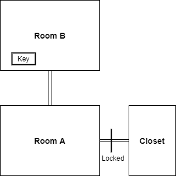

# Game Design Doc

## Overview
This project is a text adventure game played through a web browser. The player navigates through the game using text commands ('enter room', 'take key', etc), and has to solve the game using items acquired and routes unlocked.  
The project originated from a mini game jam my son and I had one Sunday. We decided to do a text adventure where he would write up the store and I would code up the game. Early on, I realized that I didn't want to just offer multiple choices for the user. Instead, I wanted a player to be able to type in commands to interface with the project. 

## Sample Problem
In order to figure out the game engine, I started with a very basic scenario. A starting room (Room A) with an open door to another room (room B), and a locked closet. In order to unlock the closet and enter, the player would have to travel to Room B, 'take the key', and then return to Room A and  'use the key':

